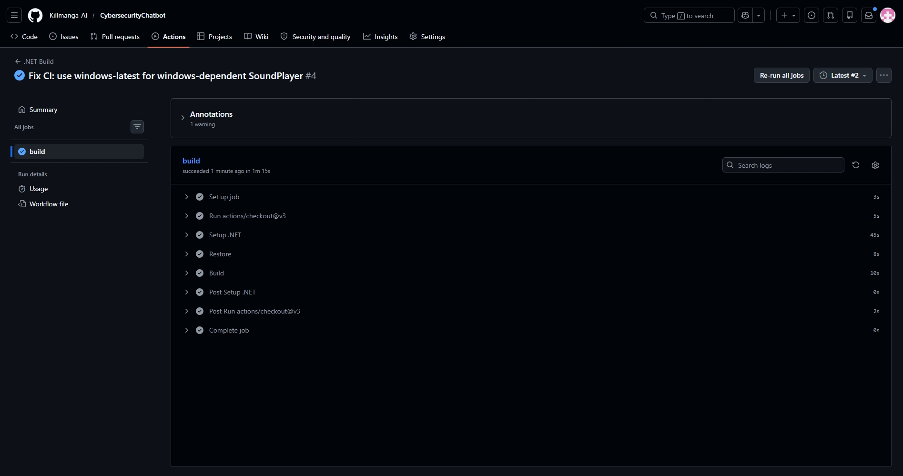

# Cybersecurity Awareness Chatbot – Part 1

## Project Overview
A C# console-based chatbot designed to educate South African citizens about cybersecurity threats such as phishing, weak passwords, and unsafe browsing. This is Part 1 of a three-part Portfolio of Evidence (POE) for a programming module.

## Features Implemented
- Voice greeting – plays a recorded `.wav` message on startup  
- ASCII art logo – “Orbit” cybersecurity theme with coloured console output  
- Personalised interaction – asks for the user’s name and uses it in responses  
- Keyword responses – recognises: `password`, `phishing`, `safe browsing`, `how are you`, `purpose`, `help`  
- Input validation – handles empty input and unknown queries with friendly fallback messages  
- Enhanced console UI – colours, dividers, spacing, and structured layout  
- Modular code – separated into `Program.cs`, `UI.cs`, `Chatbot.cs`, `AudioPlayer.cs`  
- GitHub version control – minimum 6 meaningful commits  
- Continuous Integration – GitHub Actions workflow that builds the project on every push  

## How to Run the Program

### Prerequisites
- Windows OS (for `System.Media` SoundPlayer)
- .NET 6.0 SDK or later
- Visual Studio 2022 (or any C# IDE)

### Steps
1. Clone or download this repository.
2. Open the project file (`CyberSecurityChatbot.csproj`) in Visual Studio 2022.
3. Ensure the `greeting.wav` file is present and its Copy to Output Directory property is set to Copy Always.
4. Press `Ctrl+F5` (Start Without Debugging) to run.
5. Type `help` to see available topics, or ask about `password`, `phishing`, or `safe browsing`.
6. Type `exit` to quit.

### Example Interaction

[?] Enter your name: Thabo

[!] Welcome, Thabo!

Type 'help' for topics or 'exit' to quit.

---

Thabo > password [TIP] Use long, unique passwords + a password manager.

## Continuous Integration Status
GitHub Actions automatically builds the project on every commit.  
Latest build status: PASSED (check mark)

## Repository Structure

CyberSecurityChatbot/ ├── .github/workflows/ci.yml ├── AudioPlayer.cs ├── Chatbot.cs ├── CyberSecurityChatbot.csproj ├── Program.cs ├── UI.cs ├── greeting.wav └── README.md

## Commit History (≥6 commits)
| Commit | Description |
|--------|-------------|
| 1 | Initial commit: project structure and Program.cs |
| 2 | Added UI class with Orbitz ASCII art and colour formatting |
| 3 | Implemented voice greeting using SoundPlayer and WAV file |
| 4 | Added chatbot response system with cybersecurity keywords |
| 5 | Improved input validation and default response handling |
| 6 | Added README and GitHub Actions CI workflow |

## Video Presentation
I recorded a screen demo: file name `Screen Recording 2026-04-13 173506.mp4`.

### Demo video  

[Play the demo video](https://canva.link/g2nwn7rauf0z923)

## Author & Assessment
- Module: Programming POE – Part 1    
- Date: 13 April 2026

## References
Pieterse, H. 2021. The Cyber Threat Landscape in South Africa: A 10-Year Review. African Journal of Information and Communication, 28(28). doi:10.23962/10539/32213
