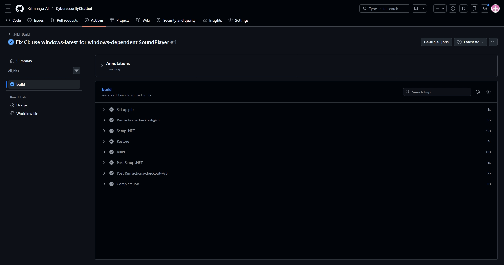

# Cybersecurity Awareness Chatbot – Part 1

## Project Overview
A C# console-based chatbot designed to educate South African citizens about cybersecurity threats such as phishing, weak passwords, and unsafe browsing. This is Part 1 of a three-part Portfolio of Evidence (POE) for a programming module.

## Features Implemented
- Voice greeting – plays a recorded `.wav` message on startup  
- ASCII art logo – “Orbit” cybersecurity theme with coloured console output  
- Personalised interaction – asks for the user’s name and uses it in responses  
- Keyword responses – recognises: `password`, `phishing`, `safe browsing`, `how are you`, `purpose`, `help`  
- Input validation – handles empty input and unknown queries with friendly fallback messages  
- Enhanced console UI – colours, dividers, spacing, and structured layout  
- Modular code – separated into `Program.cs`, `UI.cs`, `Chatbot.cs`, `AudioPlayer.cs`  
- GitHub version control – minimum 6 meaningful commits  
- Continuous Integration – GitHub Actions workflow that builds the project on every push  

## How to Run the Program

### Prerequisites
- Windows OS (for `System.Media` SoundPlayer)
- .NET 6.0 SDK or later
- Visual Studio 2022 (or any C# IDE)

### Steps
1. Clone or download this repository.
2. Open the project file (`CyberSecurityChatbot.csproj`) in Visual Studio 2022.
3. Ensure the `greeting.wav` file is present and its Copy to Output Directory property is set to Copy Always.
4. Press `Ctrl+F5` (Start Without Debugging) to run.
5. Type `help` to see available topics, or ask about `password`, `phishing`, or `safe browsing`.
6. Type `exit` to quit.

### Example Interaction

[?] Enter your name: Thabo

[!] Welcome, Thabo!

Type 'help' for topics or 'exit' to quit.


---

Thabo > password [TIP] Use long, unique passwords + a password manager.

## Continuous Integration Status
GitHub Actions automatically builds the project on every commit.  
Latest build status: PASSED (check mark)



## Repository Structure

CyberSecurityChatbot/ ├── .github/workflows/ci.yml ├── AudioPlayer.cs ├── Chatbot.cs ├── CyberSecurityChatbot.csproj ├── Program.cs ├── UI.cs ├── greeting.wav └── README.md

## Commit History (≥6 commits)
| Commit | Description |
|--------|-------------|
| 1 | Initial commit: project structure and Program.cs |
| 2 | Added UI class with Orbitz ASCII art and colour formatting |
| 3 | Implemented voice greeting using SoundPlayer and WAV file |
| 4 | Added chatbot response system with cybersecurity keywords |
| 5 | Improved input validation and default response handling |
| 6 | Added README and GitHub Actions CI workflow |

## Part 2 — WPF GUI Application

The console chatbot has been migrated to a Windows Presentation Foundation (WPF) GUI application with enhanced features.

### How to Run Part 2

#### Prerequisites
- Windows OS
- .NET 8.0 SDK or later
- Visual Studio 2022 or VS Code with C# extension

#### Steps
1. Navigate to the `CybersecurityChatbotPart2` folder.
2. Run the application using one of the following methods:

**Using Terminal:**
```bash
cd CybersecurityChatbotPart2
dotnet run
```

**Using Visual Studio:**
- Open `CybersecurityChatbotPart2.csproj` in Visual Studio 2022
- Press `Ctrl+F5` (Start Without Debugging) or `F5` (Debug)

#### Using the Application
- **Type messages** in the input box to chat with the Orbit Security assistant
- **Click Send** or press **Enter** to submit your message
- **Click Clear Memory** to reset the chatbot's memory of your previous interactions
- **Ask about:** phishing, passwords, malware, social engineering, privacy
- The bot provides helpful tips, alerts, and personalized responses based on your sentiment and conversation history

#### Example Interaction

```
Bot: Hello! I am your Orbit Security assistant. How can I help you?

You: Tell me about phishing
Bot: [ALERT] Don't click suspicious links. Verify the sender.

You: Tell me more
Bot: Verify the sender's email address by hovering over the display name.

You: I'm worried about this
Bot: It's completely normal to feel concerned about this. [ALERT] Ensure your antivirus is updated and avoid untrusted downloads.
```

#### Features
- **Real-time chat interface** with scrollable message history
- **Sentiment detection** – adapts responses based on worried, curious, or frustrated tone
- **Conversation memory** – remembers previous topics and provides follow-up tips
- **User personalization** – remembers your name and favorite topics
- **Cybersecurity topics:** phishing, passwords, malware, social engineering, privacy
- **Clear, colored interface** with Orbit branding

---

## Part 2 Commit Plan

The Part 2 work was organised as follows:

1. **feat**: Initialize WPF project with ASCII art header and chat layout
   - Add WPF application files: `App.xaml`, `App.xaml.cs`, `MainWindow.xaml`, `MainWindow.xaml.cs`
   - Update `CyberSecurityChatbot.csproj` to target WPF
   - Include ASCII art header in the GUI and a basic chat layout (ListBox, TextBox, Send/Speak buttons)

2. **feat**: Integrate speech synthesis — auto-speak greeting and Speak button
   - Add `System.Speech` reference
   - Use `SpeechSynthesizer` to speak the greeting on window load and to read the last bot message

3. **feat**: Implement ChatbotEngine with keyword recognition and random responses
   - Add `ChatbotEngine.cs` with dictionaries for keyword responses and random tips
   - Provide `GetGreeting()` and `GetResponse()` methods

4. **feat**: Add conversation flow — follow-up detection
   - Track last topic and respond to "tell me more", "another tip", "explain" by returning topic-specific tips

5. **feat**: Implement user memory and sentiment detection
   - Remember user name and favourite topic
   - Detect sentiment (worried/curious/frustrated) and adapt responses

6. **refactor**: Optimise, add robust fallback, ready for Part 3
   - Use safe collection accessors (`GetValueOrDefault`) and improve error handling
   - Add Enter key send, optional auto-speak toggle, and XML comments

Each commit will be small, self-contained, and build on the previous one to keep the history clear and reviewable.

## Video Presentation
I recorded a screen demo: file name `Screen Recording 2026-04-13 173506.mp4`.

### Demo video  

[Play the demo video](https://canva.link/g2nwn7rauf0z923)

## Author & Assessment
- Module: Programming POE – Part 1    
- Date: 13 April 2026

## References
Pieterse, H. 2021. The Cyber Threat Landscape in South Africa: A 10-Year Review. African Journal of Information and Communication, 28(28). doi:10.23962/10539/32213

---

# Part 2 Updates – WPF Edition with Memory & Sentiment Detection (May 29, 2026)

## New Features Added

### Memory System
- **User Name Recognition** – Stores user name via regex patterns: "my name is", "call me", "i am", "i'm"
- **Favorite Topic Storage** – Learns interests: "interested in", "i like", "i want to learn about"
- **Clear Memory Button** – GUI button to reset stored user information

### Sentiment Detection with Delegate Pattern
- **Sentiment Adjuster Delegate** – Extensible pattern for customizable response adjustment
- **Emotional Recognition** – Detects user sentiment:
  - **Worried** – Reassuring tone: "It's completely normal to feel concerned about this..."
  - **Curious** – Encouraging tone: "I'm glad you're interested in learning more!..."
  - **Frustrated** – Empathetic tone: "I understand this can be frustrating. Let me help:..."
  - **Neutral** – Standard responses
- **Regex-based Sentiment Patterns** – Keywords: worried, concerned, scared, anxious, curious, interested, frustrated, confused

### GitHub Actions CI/CD
- **Automated Builds** – GitHub Actions workflow triggers on push/pull request to `main` or `master`
- **Workflow Configuration** – `.github/workflows/dotnet.yml`
  - Sets up .NET 8.0.x
  - Builds `CybersecurityChatbotPart2.csproj`
  - Reports success/failure

## Part 2 Technical Implementation

### Updated `ChatBotEngine.cs`
```csharp
public delegate string SentimentAdjuster(string baseMessage, string sentiment);
public SentimentAdjuster? AdjustMessageForSentiment { get; set; }

public ChatBotEngine()
{
    AdjustMessageForSentiment = (baseMessage, sentiment) =>
    {
        switch (sentiment.ToLower())
        {
            case "worried": return $"It's completely normal to feel concerned about this. {baseMessage}";
            case "curious": return $"I'm glad you're interested in learning more! {baseMessage}";
            case "frustrated": return $"I understand this can be frustrating. Let me help: {baseMessage}";
            default: return baseMessage;
        }
    };
}

private string DetectSentiment(string input)
{
    if (Regex.IsMatch(input, @"worried|concerned|scared|anxious|nervous|fear|afraid", RegexOptions.IgnoreCase)) return "worried";
    if (Regex.IsMatch(input, @"curious|wonder|learn|understand|interested|tell me about", RegexOptions.IgnoreCase)) return "curious";
    if (Regex.IsMatch(input, @"frustrated|annoyed|confused|don't understand|what does that mean", RegexOptions.IgnoreCase)) return "frustrated";
    return "neutral";
}
```

### Updated UI (`MainWindow.xaml`)
Added third column with "Clear Memory" button:
```xml
<Grid.ColumnDefinitions>
    <ColumnDefinition Width="*"/>
    <ColumnDefinition Width="Auto"/>
    <ColumnDefinition Width="Auto"/> <!-- New column -->
</Grid.ColumnDefinitions>
<Button x:Name="ClearMemoryButton" Grid.Column="2" Content="Clear Memory" Background="#E67E22" Foreground="White" FontWeight="Bold" Padding="5" Click="ClearMemoryButton_Click"/>
```

### GitHub Actions Workflow
Created `.github/workflows/dotnet.yml` for automated CI builds on every commit.

## Example Part 2 Interactions

**User:** "My name is Alex and I'm interested in phishing"  
**Bot:** "Nice to meet you, Alex! I'll remember your name."

**User:** "Tell me about phishing" (curious sentiment detected)  
**Bot:** "I'm glad you're interested in learning more! [ALERT] Don't click suspicious links. Verify the sender. As someone interested in phishing, you might find this especially useful."

**User:** "I'm worried about malware" (worried sentiment detected)  
**Bot:** "It's completely normal to feel concerned about this. Alex, [ALERT] Ensure your antivirus is updated and avoid untrusted downloads."

## Part 2 Commit Plan (Completed)

1. ✅ **feat**: Add ChatBotEngine with keyword recognition (Commit 4 – Original)
2. ✅ **feat**: Add Memory (Name & Favorite Topic) with GUI Clear button
3. ✅ **feat**: Add Sentiment Detection with Delegate Pattern
4. ✅ **feat**: GitHub Actions CI workflow setup
5. ✅ **docs**: Update README with Part 2 features and build instructions

## Technologies Used (Part 2)
- C# (.NET 8.0-9.0)
- WPF (Windows Presentation Foundation)
- Regex (System.Text.RegularExpressions)
- GitHub Actions (CI/CD)
- Git/GitHub

## Build Instructions (Part 2)

### From Visual Studio 2022
1. Open `CybersecurityChatbotPart2/CybersecurityChatbotPart2.csproj`
2. Press `Ctrl+F5` to run

### From Command Line
```powershell
cd CybersecurityChatbot
dotnet build CybersecurityChatbotPart2/CybersecurityChatbotPart2.csproj
dotnet run --project CybersecurityChatbotPart2/CybersecurityChatbotPart2.csproj
```

## Continuous Integration Status (Part 2)
GitHub Actions automatically builds the WPF project on every commit to `main` or `master`.  
Check the Actions tab for build history and status.
